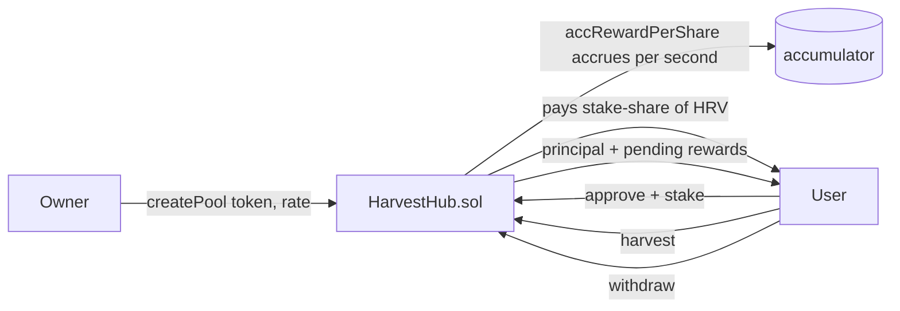

# HarvestHub — a multi-pool yield farm with real-time rewards

> Stake different tokens across multiple pools, each emitting the same reward
> token at its own per-second rate. Rewards accrue with the MasterChef
> accumulator pattern — O(1) staking no matter how many users a pool has.


-success)


🔗 **Live demo:** _deploy to Netlify pending_
📜 **HarvestHub (Sepolia):** [0xc11faB6eA199Ebd60207d5b8C3de2C3b0aB918d4](https://sepolia.etherscan.io/address/0xc11faB6eA199Ebd60207d5b8C3de2C3b0aB918d4)

---

## What it does

- The owner creates **staking pools**, each for a different ERC20 and with its own
  **reward rate** (reward tokens emitted per second).
- Users **stake** into any pool, **harvest** rewards at any time, and **withdraw**
  their principal. Staking and withdrawing auto-harvest pending rewards.
- Rewards are shared **proportionally to your stake share** for the time you were in
  the pool — a user who joins late never collects rewards that accrued before them.
- The demo ships two live pools on Sepolia (SEED and CORN) with open token faucets,
  so anyone can try the full stake → earn → harvest loop.

Single-pool staking was [YieldGarden (Block 7)](https://github.com/Armando8a-dev/yield-garden).
HarvestHub is the multi-pool generalization.

## How the rewards work (the MasterChef pattern)

The naive way to pay yield is to loop over every staker and credit them — which runs
out of gas as the pool grows. Instead, each pool keeps a single running accumulator:

```
accRewardPerShare += (secondsElapsed × rewardRate × 1e18) / totalStaked
```

and each user stores a `rewardDebt` snapshot. Their claimable amount is always:

```
pending = stakedAmount × accRewardPerShare / 1e18 − rewardDebt
```

Both `stake` and `withdraw` reset `rewardDebt` after paying out, so no matter how many
users are in a pool, every operation is **O(1)**. This is the same accounting SushiSwap's
MasterChef and countless farms use in production.



## Why pool ids are collision-safe

Each pool id is `keccak256(abi.encodePacked(stakeToken, rewardRate, block.timestamp,
block.chainid))`. Every argument is **fixed-length** (`address`, `uint256`, `uint256`,
`uint256`), so the packed bytes are unambiguous and cannot collide — exactly the safe
case documented in [hash-forge (Block 14)](https://github.com/Armando8a-dev/hash-forge).
Used with two dynamic arguments, this same `encodePacked` would be exploitable.

## Tests

`forge test` — 9 tests, including a 1000-run fuzz:

| Test | What it proves |
|------|----------------|
| `test_SingleStaker_AccruesAtRate` | a sole staker earns `seconds × rate` |
| `test_TwoStakers_SplitProportionally` | rewards split by stake share (25/75) |
| `test_LateStaker_DoesNotStealEarlierRewards` | the core MasterChef guarantee |
| `test_Pools_AccrueIndependently` | two pools emit at their own rates |
| `test_Withdraw_ReturnsPrincipalAndRewards` | withdraw returns principal + auto-harvest |
| `test_RewardShortfall_CapsPayoutAtBalance` | an under-funded pool caps payout, never bricks |
| `testFuzz_ViewMatchesPaid` | `pendingRewards()` view == actual payout, 1000 runs |

## Run it

```bash
# contracts
git submodule update --init --recursive
forge test -vv

# frontend
cd frontend
npm ci
npm run dev   # http://localhost:3000
```

## Stack

- **Contracts:** Solidity 0.8.24, Foundry, OpenZeppelin (SafeERC20, ReentrancyGuard, Ownable)
- **Frontend:** Next.js 15, wagmi v2, viem, RainbowKit, Tailwind v4
- **Network:** Sepolia testnet

## What I learned

- The MasterChef accumulator turns "pay every staker" from an O(n) loop into O(1)
  bookkeeping — the `rewardDebt` snapshot is what makes late joiners fair automatically.
- `pendingRewards()` reports theoretical accrual; the actual payout is capped at the
  hub's reward balance so a shortfall degrades gracefully instead of reverting.
- A multi-pool design is mostly the same contract as single-pool, keyed by a pool id —
  and choosing `encodePacked` with only fixed-length args keeps that key collision-free.

---

**Armando Ochoa** · Smart Contract Developer
Part of a 17-block blockchain accelerator — this is the yield-farming module (Block 15).
